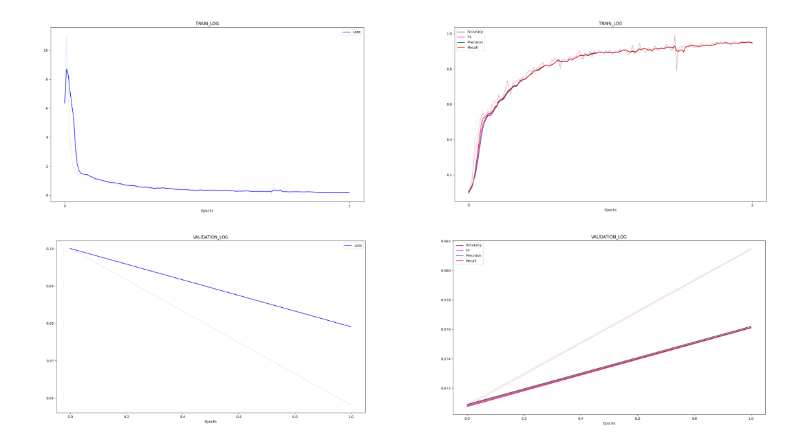

### A complete, robust and super easy pytorch prototyping framework to get started on deep learning within minutes.


[](https://github.com/sraashis/easytorch/actions)


<hr />

#### Installation

1. `Install latest pytorch and torchvision from` [Pytorch](https://pytorch.org/)
2. `pip install easytorch`

#### `How to use? Check out the MNIST Example:`

```python
from easytorch import EasyTorch, ETTrainer, ConfusionMatrix, ETMeter
from torchvision import datasets, transforms
from torch import nn
import torch.nn.functional as F
import torch

transform = transforms.Compose([
    transforms.ToTensor(),
    transforms.Normalize((0.1307,), (0.3081,))
])


"""
Define the neural network. I just burrowed from here:
 https://github.com/pytorch/examples/blob/master/mnist/main.py
"""
class MNISTNet(nn.Module):
    def __init__(self):
        super(MNISTNet, self).__init__()
        self.conv1 = nn.Conv2d(1, 32, 3, 1)
        self.conv2 = nn.Conv2d(32, 64, 3, 1)
        self.dropout1 = nn.Dropout(0.25)
        self.dropout2 = nn.Dropout(0.5)
        self.fc1 = nn.Linear(9216, 128)
        self.fc2 = nn.Linear(128, 10)

    def forward(self, x):
        x = self.conv1(x)
        x = F.relu(x)
        x = self.conv2(x)
        x = F.relu(x)
        x = F.max_pool2d(x, 2)
        x = self.dropout1(x)
        x = torch.flatten(x, 1)
        x = self.fc1(x)
        x = F.relu(x)
        x = self.dropout2(x)
        x = self.fc2(x)
        output = F.log_softmax(x, dim=1)
        return output


class MNISTTrainer(ETTrainer):
    def _init_nn_model(self):
        self.nn['model'] = MNISTNet()

    def iteration(self, batch):
        inputs = batch[0].to(self.device['gpu']).float()
        labels = batch[1].to(self.device['gpu']).long()

        out = self.nn['model'](inputs)
        loss = F.nll_loss(out, labels)

        _, pred = torch.max(out, 1)
        meter = self.new_meter()
        meter.averages.add(loss.item(), len(inputs))
        meter.metrics['cfm'].add(pred, labels.float())

        return {'loss': loss, 'meter': meter, 'predictions': pred}

    def init_experiment_cache(self):
        self.cache['log_header'] = 'Loss|Accuracy,F1,Precision,Recall'
        self.cache.update(monitor_metric='f1', metric_direction='maximize')

    def new_meter(self):
        return ETMeter(
            cfm=ConfusionMatrix(num_classes=10)
        )


if __name__ == "__main__":
  train_dataset = datasets.MNIST('../data', train=True, download=True,
                                 transform=transform)
  val_dataset = datasets.MNIST('../data', train=False,
                               transform=transform)
  
  dataloader_args = {'train': {'dataset': train_dataset},
                     'validation': {'dataset': val_dataset}}
  runner = EasyTorch(phase='train',
                     batch_size=512, epochs=10, gpus=[0],
                     dataloader_args=dataloader_args)
  runner.run(MNISTTrainer)
```

#### Plots generated by build-in plotter



* [MNIST](./examples/MNIST_easytorch_CNN.ipynb) [](https://colab.research.google.com/github//sraashis/easytorch/blob/master/examples/MNIST_easytorch_CNN.ipynb)
* [Retinal blood vessel segmentation with U-Net.](https://github.com/sraashis/unet-vessel-segmentation-easytorch)
* [Covid-19 chest x-ray classification.](https://github.com/sraashis/covidxfactory)
* [DCGAN.](https://github.com/sraashis/gan-easytorch-celeb-faces)

<hr />


### General use case:

#### 1. Define your trainer

```python
from easytorch import ETTrainer, Prf1a, ETMeter, AUCROCMetrics


class MyTrainer(ETTrainer):

    def _init_nn_model(self):
        self.nn['model'] = NeuralNetModel(out_size=self.args['num_class'])

    def iteration(self, batch):
        inputs = batch[0].to(self.device['gpu']).float()
        labels = batch[1].to(self.device['gpu']).long()

        out = self.nn['model'](inputs)
        loss = F.nll_loss(out, labels)

        _, pred = torch.max(out, 1)
        meter = self.new_meter()
        meter.averages.add(loss.item(), len(inputs))
        meter.metrics['prf1a'].add(pred, labels)
        meter.metrics['auc'].add(out[:, 1], labels)

        """Must have loss and meter"""
        return {'loss': loss, 'meter': meter, 'predictions': pred}

    def new_meter(self):
        """Any implementation of easytorch.metrics.ETMetrics. Prf1a() is provided for Precision, Recall and F1 Score"""
        """num_averages=how manu averages(like loss, default=1) to track. Can track as many as you want. Check GAN example above."""
        return ETMeter(
            num_averages=1,
            prf1a=Prf1a(),
            auc=AUCROCMetrics()
        )

    def init_experiment_cache(self):
        """Will plot Loss in one plot, and Accuracy,F1 in another."""
        self.cache['log_header'] = 'Loss|Accuracy,F1_score' 
        """Model selection"""
        self.cache.update(monitor_metric='f1', metric_direction='maximize')

````

* Method new_meter() returns ETMeter that takes any implementation of easytorch.meter.ETMetrics as:
    * easytorch.metrics.Prf1a() for binary classification that computes accuracy,f1,precision,recall, overlap/IOU.
    * easytorch.metrics.ConfusionMatrix(num_classes=...) for multiclass classification that also computes global
      accuracy,f1,precision,recall.
    * easytorch.metrics.AUCROCMetrics for binary ROC-AUC score.

#### 2. Use custom dataset as below, or pytorch based Datasets class as in MNIST example above.

Define specification for your datasets:

```python
import os

def get_label1(x):
  return x.split('_')[0] + 'label.csv'

sep = os.sep
MYDATA = {
    'name': 'mydata',
    'data_dir': 'MYDATA' + sep + 'images',
    'label_dir': 'MYDATA' + sep + 'labels',
    'split_dir': 'MYDATA' + sep + 'splits', """For custom splits."""
    'label_getter': get_label1
}

def get_label2(x):
  return x.split('_')[0] + 'label.csv'

MyOTHERDATA = {
    'name': 'otherdata',
    'data_dir': 'OTHERDATA' + sep + 'images',
    'label_dir': 'OTHERDATA' + sep + 'labels',
    'label_getter': get_label2
}
```
* EasyTorch automatically splits the data/images in 'data_dir' of dataspec as specified (split_ratio, or num_folds in EasyTorch Module as below), and runs accordingly. 
* One can also provide custom splits(json files with train, validation, test data list) in the directory specified by split_dir in dataspec.
* Additional options in dataspecs:
  * Load from sub-folders, "sub_folders": ["class0", "class1", ... "class_K"]
  * Load recursively, "recursive": True
  * Filter by an extension, "extension": "png"
* Example:
```python
DRIVE = {
    'name': 'DRIVE',
    'data_dir': 'DRIVE' + sep + 'images',
    'label_dir': 'DRIVE' + sep + 'manual',
    'mask_dir': 'DRIVE' + sep + 'mask',
    'split_dir': 'DRIVE' + sep + 'splits',
    'label_getter': get_label_drive,
    'mask_getter': get_mask_drive,
    'sub_folders': ['None', 'Mild', 'Severe', "Proliferative"],
    'extension': '.tif',
    'recursive': True
}
```

Define how to load each data item by using EasyTorch's base ETDataset class to get extra benefits like limit loading for debugging, pooling
data, super-fast pre-processing with multiple processes, and many more ...

```python
from easytorch import ETDataset
import torchvision


class MyDataset(ETDataset):
    def __init__(self, **kw):
        super().__init__(**kw)
        
    def load_index(self, dataset_name, file):
      """1. This method is a pre-processing step for all the files in the specified folders in dataspec."""
      """2. It is parallelized and uses num_workers number of processes to pre-load, preprocess data enabling us"""
      """   to perform such operations super fast"""
      """3. It is a pre-training step. So, a different mechanism then num_worker in data_loader object"""
      """   Example: any pre-processing masking, cropping patches for uneven images in U-Net"""
      pass

    def __getitem__(self, index):
        dataset_name, file = self.indices[index]
        dataspec = self.dataspecs[dataset_name]

        """
        All the info. (data_dir, label_dir, label_getter...) defined above will be in dataspec.
        """
        image =  # Todo # Load file/Image. 
        label =  # Todo # Load corresponding label.
        # Extra preprocessing, if needed.
        # Apply transforms.

        return image, label
```

#### 3. Entry point
```python
from easytorch import EasyTorch

runner = EasyTorch([MYDATA, MyOTHERDATA],
                   phase="train", batch_size=4, epochs=21,
                   num_channel=1, num_class=2,
                   split_ratio=[0.6, 0.2, 0.2])  # or num_folds=5 (exclusive with split_ratio)

if __name__ == "__main__":
    """Runs experiment for each dataspec items in the same order"""
    runner.run(MyTrainer, MyDataset)
  
    """Runs by pooling all dataspecs as a single experiment"""
    # runner.run_pooled(MyTrainer, MyDataset)
```
<hr />

#### `Feature Higlights`

* Minimal configuration to setup any simple/complex experiment (Single GPU, DP, and [DDP usage](assets/DefaultArgs.md)).
* DataHandle that is always available, and decoupled from other modules enabling easy customization ([ETDataHandle](easytorch/data/data.py)).
  * Use custom & complex data handling mechanism.
  * Load folder datasets.
  * Load recursively large datasets with multiple threads.
* Full support to split images into patches and rejoin/merge them to get back the complete prediction image like in
  U-Net(Usually needed when input images are large, and of different shapes) (Thanks to sparse data loaders).
* Limit data loading- Limit data to debug the pipeline without moving data from the original place (Thanks to
  load_limit)
* Heterogeneous datasets handling-One can use many folders of dataset by just defining dataspecs and use in single
  experiment(Thanks to pooled run).
* Automatic k-fold cross validation/Auto dataset split (Example: num_folds=10, or split_ratio=[0.6, 0.2, 0.2])
* Simple lightweight logger/plotter.
    * **Plot:** set log_header = 'Loss,F1,Accuracy' to plot in same plot or set log_header = 'Loss|F1,Accuracy' to plot
      Loss in one plot, and F1,Accuracy in another plot.
    * **Logs:** all arguments/generated data will be saved in logs.json file after the experiment finishes.
* Gradient accumulation, automatic logging/plotting, model checkpointing
* Multiple metrics implementation at easytorch.metrics: Precision, Recall, Accuracy, Overlap, F1, ROC-AUC, Confusion matrix
  [..more features](assets/Features.md)
* **For advanced training with multiple networks, and complex training steps,
  click [here](assets/AdvancedTraining.md):**
* **Implement custom metrics as [here](assets/CustomMetrics.md).**

<hr />

**Default arguments[default-value]. [Easily add custom arguments.](assets/DefaultArgs.md)**

* **-ph/--phase** [Required]
    * Which phase to run? 'train' (runs all train, validation, test steps) OR 'test' (runs only test step).
* **-b/--batch_size** [4]
* **-ep/--epochs** [11]
* **-lr/--learning_rate** [0.001]
* -**gpus/--gpus** [0]
    * List of gpus to be used. Eg. [0], [1], [0, 1]
* **-nw/--num_workers** [0]
    * Number of workers for data loading so that cpu can keep-up with GPU speed when loading mini-batches.
* **-lim/--load-limit**[None]
    * Specifies a limit on images/files to load for debug purpose for pipeline debugging.
* **-nf/--num_folds** [None]
    * Number of folds in k-fold cross validation(Integer value like 5, 10).
* **-spl/--split_ratio** [None]
    * Split ratio for train, validation, test set if two items given| train, test if three items given| train only if
      one item given.
* [...see more (ddp args)](assets/DefaultArgs.md)

### All the best! Cheers! 🎉

#### Please star or cite if you find it useful.

```
@misc{easytorch,
  author = {Khanal, Aashis},
  title = {Easy Torch}
  year = {2020},
  publisher = {GitHub},
  journal = {GitHub repository},
  url = {https://github.com/sraashis/easytorch}
}
```
